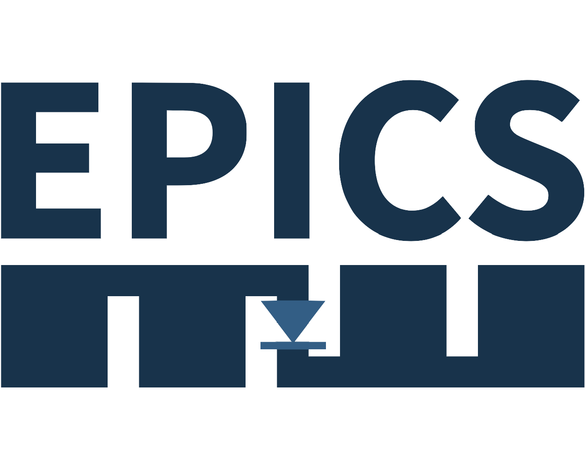

<table>
  <tr> 
      <th width="20%"></th>
      <th><h2>EPICS Diode</h2>Unidirectional transport for EPICS</th>
  </tr>
</table>

The main purpose of `EPICS Diode` is to implement a unidirectional transfer of `EPICS channel` value changes,
usually transported using a bidirectional TCP/IP-based protocol `EPICS Channel Access (CA)`, between segmented networks.

This allows placing a unidirectional network communication device (aka diode) that enables the safe, one-way transfer of data between segmented networks.
The diodes effectively eliminate external points of entry to the sending system, preventing intruders and contagious elements from infiltrating the network.

---

[Building](documentation/building.rst)

[Requirements](documentation/requirements.rst)

[Design](documentation/design.rst)

[EPICS Diode Protocol](documentation/protocol.rst)

[EPICS Diode Tools](documentation/tools.rst)

[Example](documentation/example.rst)

[Requirements Traceability Matrix](documentation/requirements_traceability_matrix.rst)

[Quality Assurance / Testing Proposal](documentation/qa_proposal.rst)

[Testing HOWTO](documentation/test_howto.rst)
