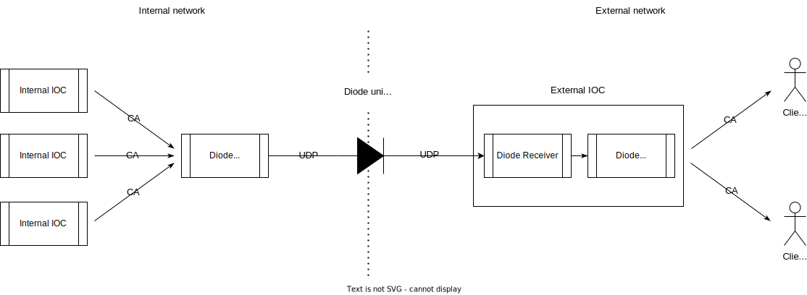

Overview
========

Motivation
----------

Propagation of EPICS traffic to remote (external, untrusted) sites has always been considered a valuable feature by clients.
However, the implementation using standard EPICS (gateway) can often be found insufficiently secure by security audits.
It was deemed that investment into fortifying the existing gateway software would not solve a fundamental problem [#fn1]_,
and a design breaking a protocol to something suitable for hardware network diode, e.g. unidirectional UDP, should be pursued.

.. [#fn1] Mainly due to security restrictions in terms of traffic flow segmentation - the traffic shall be unidirectional,
  i.e. no direct flow from external (untrusted) network to internal.

Basic architecture
------------------

The EPCIS diode consists of three components: a *sender* that gathers EPICS traffic from an internal network and sends it
using *unidirectional transport* to one-or-many *receivers* residing in an external network:

   EPICS Diode basic architecture.

Each component is described in detail in the following sections.

Design
======

Transport
---------

A key feature of `EPICS Diode` is unidirectional transport. This also brings disadvantages.
The limitations of unidirectional transports are:

- Unidirectional transports are inherently unreliable since they have no way of informing a sender whether a message was received or not.
  The sender gets no feedback from receivers. Loss of messages results in large latencies (waiting and hoping for the next message not to be lost).
  In the case of large array data, e.g. images, data needs to be fragmented to be sent over the network and a loss of just one fragment
  already implies a loss of the entire data. With a larger number of fragments probability of this happening increases. 
- Lack of feedback also implies there is no flow/congestion control. These mechanisms ensure that the sender will not overflow
  the receiver with messages (resulting in loss of messages) and allow (fair) coexistence of different senders on the network.
  Sudden bursts of traffic can also choke otherwise healthy and sufficient network links resulting in a degradation of the entire network.
  Since unidirectional protocols cannot implement these mechanisms they usually use a simple rate-limiting flow control where the maximum
  sending rate is limited, e.g. 10MB/s. This imposes a limit on transport throughput and increased latencies. 

Choosing unidirectional UDP as transport has (therefore) the following implications:

- a sender must resend a last update message of a channel if no other update was sent in ``heartbeat period`` of time,
- not having received any update from one channel in 2x ``heartbeat period`` turns the channel value invalid (on the receiver side), 
- a mechanism to detect out-of-order, duplicate, or failed message delivery needs to be implemented (e.g. using global packet sequence number), 
- due to the limitation of the maximum UDP packet size messages exceeding this limit need to be fragmented (e.g. for large array values),
- rate-limited flow control needs to be implemented,
- consequently keep the amount of data sent to a minimum, i.e. avoid sending channel names and channel metadata 
  over the network and cache them using configuration instead; both sides are required to use the same configuration.

Refer to the :doc:`protocol` document for protocol details.

Sender
------

`Sender` is a `EPICS Channel Access (CA)` client subscribing to a predefined list of channels and pushing changes
to the transport. The list of channels is read from the `configuration`_ file - array node named ``channel_names``.
Each channel is assigned an ``index`` corresponding to its position in the array (starting with 0). This index is used
by the sender and receivers to identify channels.

Record non-default field channels (shorter term ``field`` will be used in this document) alse get assigned an index.
The are two kinds of fields, ``extra fields`` (see ``extra_fields`` in `configuration`_) represent fields additional to the default field,
that we can subscribe to. On the other hand ``polled fields``, as the name suggests, are polled (see ``polled_fields`` in `configuration`_).
Their fields' indexes are calculated as:

.. code-block:: none

  extra field index = parent channel index + position (starting with 1) in extra_fields array.

  polled field index = parent channel index + extra_field array length + position (starting with 1) in polled_fields array.

This implies that the default record field channels (shorter term ``record channel`` will be used in this document) index is calculated as:
  
.. code-block:: none

  channel index = previous channel index + previous channel extra_field array length + previous channel polled_field array length + 1.

On startup the sender initiates asynchronous connect requests for all the channels in the list. Upon successful connection,
it stores channel data (``type`` and ``count``) and preallocates memory space for its value. Then ``create subscription`` request is 
issued for the channel. ``DBR_TIME_<type>`` (``DBE_VALUE | DBE_ALARM`` event mask) subscription is used for records,
whereas value-only ``DBR_<type>`` (``DBE_VALUE`` event mask) is used for extra fields. For fields that do not support subscription
updates, polling is implemented (polling period specified via configuration).
The implementation monitors the connection status of the channel. On disconnection, it marks
the channel as disconnected and puts a disconnect event in the send queue (not applicable to fields). On reconnect, the implementation
compares the new type and count against values from the previous connection and reallocates value memory space and resubscribes
with a new type and count, if necessary.

Only value-related data is sent over the network: channel ``index``, ``type``, ``count``, and ``dbr`` structure.
A disconnect event is encoded with ``count`` of value ``-1`` and no ``dbr`` structure.
All channel metadata (e.g. alarm limits) must be provided on the receiver side via configuration, e.g. generated EPICS .db file.

When the subscription event is received all the value-related data are copied to the preallocated memory space, the channel is marked to have
a pending update and put into the FIFO send queue. If another subscription event is received before the last one was actually sent the values
are updated (overridden). Since the channel has already been marked to have a pending update it is not added to the send queue again. This 
way only the most recent value for each channel is kept in the memory.

Polled fields are checked every preconfigured period of time and every received value is locally compared for changes. Only on change will the
channel get marked to have an update. This mechanism is somewhat different to subscribed fields, where subscription event is enough to consider
the field changed. Since this cannot be done with polled fields, the value checking had to be implemented. 

There is one thread that handles all CA callbacks (non-preemptive) and sending of messages.
The messages are sent periodically (``min_update_period``), thus limiting the maximum update frequency of channels to ``1 / min_update_period``.
Only updates for the channels that have been put into the send queue are being sent.  The implementation tries to fit as many as possible
updates into one packet (preserving send queue order). Once one channel data does not fit into a message buffer anymore the message is sent
and a new one is started. If a channel data value does not fit (i.e. is too large for) the message buffer, the data needs to be fragmented
and a protocol message that supports fragmentation is used. 
Once a channel is serialized to the message buffer, it is removed from the send queue and marked as cleared (i.e. no pending update).

Record channel data should always be sent with all its configured extra fields within the same packet.
This avoids a situation where in case of a packet loss the record state is transferred partially and leaves
the record on the receiver side in an inconsistent state.

The thread also handles heartbeat updates to mitigate the possible loss of updates due to unreliable protocol.
For all the record channels that have no update within one ``heartbeat_period`` time a heartbeat update is being sent,
using a current (cached) value. For disconnected or never-connected channels no update is sent;
a receiver will mark channels without updates as disconnected.

Sending messages over UDP is rate-limited by the ``rate_limit_mbs`` configuration parameter. The rate-limiting is implemented by adding a time delay
between two consecutive sends. A required time delay not to exceed the limit is calculated  (``last_sent_bytes / rate_limit_mbs``) and compared
to the time elapsed since the last send. If the elapsed time is smaller than the required a process is being put to sleep for the remaining difference.
Note that the required delays are quite small, e.g. for 64k bytes of data at 64MB/s limit the required delay equals 1us.

Statistics are also gathered and reported for diagnostics, i.e. send rate, number/percentage of channels connected/updates within a heartbeat period.

Receiver
--------

`Receiver` listens to the transport for messages. Upon arrival, the messages are first validated.
Validation includes:

- `EPICS Diode` protocol message identification check, 
- one-sender check, and
- checks for out-of-order or duplicate delivery of messages, with support for robust packet reordering using global sequence numbers.

Refer to the :doc:`protocol` document for protocol details.

If a message is valid then a registered callback is called (within the process thread) with value-related data:
channel ``index``, ``type``, ``count``, and ``dbr`` structure.
``dbr`` structure is not copied from a receive buffer but directly referenced. In the case of fragmented data,
the receiver first assembles all the fragments into an intermediate buffer and only upon reception of all
the fragments the callback is called.

On every ``heartbeat_period`` period all the record channels are checked whether they received an update within the last ``2 * heartbeat_period`` period.
If not, then the callback is called for the channel with ``count`` of value ``-1``, i.e. disconnect notification event.
The channel is also marked as disconnected to avoid repetitive disconnect notifications.

Diode IOC Engine
----------------
As shown in the :numref: `basic-arch` the receiver forwards updates to the ``diode`` engine inside EPICS IOC.
Ideally, the receiver does not need an IOC, however since there is no reliable C++ CA server implementation available other than the one in the IOC (``rsrv``),
the IOC is used as a `proxy`. This implies that all the received updates
need to be mapped to a record (or its fields). Sender-side records are mapped to the records of the same type on the receiver side.
The IOC database engine is redundant since there is no need for record processing - record fields just need to be updated and
events pushed into the CA server. ``iocInit()`` function that initializes IOC (including database engine) is replaced by ``diodeIocInit()`` function,
that removes record scanning/processing and links (database and CA) functionality. This leaves a "hollow" IOC with the record structures
and the CA server on top, but no engine below. The diode receiver thread becomes a new IOC engine.

The engine is based on the index-based look-up table (LUT). Each channel ``index`` maps to an entry in the table at a given index.
The table is initialized during ``diodeIocInit()`` function call by assigning each entry ``DBADDR addr`` structure of a record (i.e. its default value field)
or a field; using a set of ``dbFind*(name)`` functions to get a ``DBENTRY`` structure of a field and then ``dbEntryToAddr()`` function to get the ``DBADDR``.
``index`` is assigned based on the record name - position of the same channel name within a channel list as defined in the configuration.
Record information item ``diode_cix`` can be used to manually set the ``index``.

When a receiver invokes a callback with a new update for a given ``index``,
an entry at the ``index`` is fetched from the table. Then the following operations are performed: 

- a record is locked by calling ``dbScanLock(addr.precord)``,
- a record support ``dbPut(addr, type, value, count)`` function is called to update the value, 
- ``{ status, severity and timestamp }`` fields are set for record channels,

  - if ``status`` or ``severity`` have changed, a ``db_post_events()`` is called for changed fields,
- ``db_post_events()`` is called for process passive default value record fields,
  
  - for all other fields this is already done by the ``dbPut()`` function
- and finally, the record is unlocked by calling ``dbScanUnlock(addr.precord)``

A disconnected event is reported by setting ``status`` to ``UDF_ALARM`` and ``severity`` to ``INVALID_ALARM``.

Example of ``ai`` record instantiation:

.. code-block:: shell

    record(ai, "exampleAi1")
    {
        # optional to manually assign channel index: info(diode_cix, "128")
        field(EGU,  "Counts")
        field(HIHI, "8")
        field(HIGH, "6")
        field(LOW , "4")
        field(LOLO, "2")
        field(HOPR, "10")
        field(LOPR, "0")
    }

Configuration
-------------
Both `sender`_ and `receiver`_ are configured using the same JSON configuration file (inline documented):

.. code-block:: json
   :caption: EPICS Diode Configuration File

    {
      // Minimum sender update period in seconds.
      "min_update_period": 0.1,
      // Heartbeat period in seconds.
      "heartbeat_period": 15.0,
      // Maximum sender sent rate in MB/s, 0 for no limit.
      "rate_limit_mbs": 64,
      // Array of channels to export (order matters!).
      "channel_names": {
        // Each channel can be individually configured, otherwise defaults are used (no extra fields).
        //   extra_fields: additional record fields to be transported with each update
        "poz:ai1": { "extra_fields": ["RVAL"] }, 
        "poz:ai2": {}, 
        "poz:ai3": {},
        "poz:compressExample": {},
        "poz:image": {},
        "poz:one_element": {},
        "poz:stalled": {},
        "poz:enum": {}    
      }
    }

A hash value is calculated out of all attribute values and compared to ensure that they both share the same
configuration.

Implementation details
----------------------
`Sender`_, `receiver`_ and `transport`_ including configuration and logging utilities are all bundled in ``epics-diode`` shared library (source code in ``src/``).

All the protocol de-/serialization code is encapsulated within ``src/epics-diode/protocol.h`` and ``src/protocol.cpp`` files. Replacing it with an alternative
implementation requires replacing these files and the code using them, i.e. ``Sender::Impl::send_updates()`` and ``Receiver::Impl::receive_updates()`` methods.
Replacing the UDP-based protocol with something completely different, e.g. TCP-based protocol, would require changes at a higher level as this changes the protocol
responsibilities (e.g. no need for fragmentation, order and duplicate validation, heartbeats, etc.). The code is well encapsulated and would require to reimplement
``Sender::Impl`` and ``Receiver::Impl`` classes.

`Diode IOC Engine`_ is bundled in ``diodeIoc`` shared library (source code in ``ioc/``).

The entire code base is structured as EPICS base extension.

The default `EPICS Diode` UDP port is 5080.

